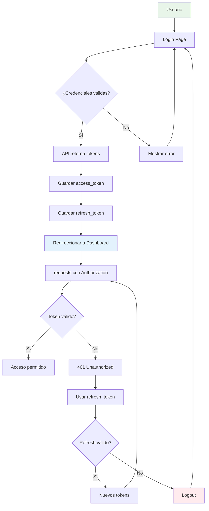

# Skill: almacen-auth-frontend

## Descripción

Patrones de autenticación JWT para el frontend de almacenTienda.

## Cuándo Usar

Usar este skill cuando se trabaje en:
- Login y logout de usuarios
- Gestión de tokens JWT
- Rutas protegidas
- Interceptors de autenticación
- Estados de sesión

## Flujo de Autenticación



## Patrones de Código

### Store de Autenticación

```tsx
import { create } from 'zustand'
import { persist } from 'zustand/middleware'

interface AuthState {
  accessToken: string | null
  refreshToken: string | null
  usuario: Usuario | null
  isAuthenticated: boolean
  
  login: (tokens: Tokens, usuario: Usuario) => void
  logout: () => void
  refresh: (tokens: Tokens) => void
}

export const useAuthStore = create<AuthState>()(
  persist(
    (set) => ({
      accessToken: null,
      refreshToken: null,
      usuario: null,
      isAuthenticated: false,
      
      login: (tokens, usuario) => set({
        accessToken: tokens.access_token,
        refreshToken: tokens.refresh_token,
        usuario,
        isAuthenticated: true,
      }),
      
      logout: () => set({
        accessToken: null,
        refreshToken: null,
        usuario: null,
        isAuthenticated: false,
      }),
      
      refresh: (tokens) => set({
        accessToken: tokens.access_token,
        refreshToken: tokens.refresh_token,
      }),
    }),
    { name: 'auth-storage' }
  )
)
```

### Hook de Autenticación

```tsx
import { useAuthStore } from '@/stores/auth'
import { api } from '@/api/axios'

interface LoginCredentials {
  email: string
  password: string
}

interface Tokens {
  access_token: string
  refresh_token: string
  expires_in: number
}

export function useAuth() {
  const { login, logout, ...auth } = useAuthStore()
  
  const authenticate = async (credentials: LoginCredentials) => {
    const response = await api.post<{ user: Usuario; tokens: Tokens }>(
      '/auth/login',
      credentials
    )
    login(response.data.tokens, response.data.user)
    return response.data
  }
  
  const handleLogout = () => {
    logout()
    window.location.href = '/login'
  }
  
  return {
    ...auth,
    authenticate,
    logout: handleLogout,
  }
}
```

### Componente Login

```tsx
import { useState } from 'react'
import { useNavigate } from 'react-router'
import { useAuth } from '@/hooks/useAuth'
import { Button } from '@/components/ui/button'
import { Input } from '@/components/ui/input'
import { Card, CardHeader, CardTitle, CardContent } from '@/components/ui/card'

export function LoginPage() {
  const [email, setEmail] = useState('')
  const [password, setPassword] = useState('')
  const [error, setError] = useState('')
  const [loading, setLoading] = useState(false)
  const { authenticate } = useAuth()
  const navigate = useNavigate()
  
  const handleSubmit = async (e: React.FormEvent) => {
    e.preventDefault()
    setError('')
    setLoading(true)
    
    try {
      await authenticate({ email, password })
      navigate('/dashboard')
    } catch (err: any) {
      setError(err.response?.data?.detail || 'Error al iniciar sesión')
    } finally {
      setLoading(false)
    }
  }
  
  return (
    <div className="flex items-center justify-center min-h-screen bg-gray-100">
      <Card className="w-full max-w-md">
        <CardHeader>
          <CardTitle>Iniciar Sesión</CardTitle>
        </CardHeader>
        <CardContent>
          <form onSubmit={handleSubmit} className="space-y-4">
            {error && (
              <div className="p-3 text-sm text-red-600 bg-red-100 rounded">
                {error}
              </div>
            )}
            <div>
              <Input
                type="email"
                placeholder="Email"
                value={email}
                onChange={(e) => setEmail(e.target.value)}
                required
              />
            </div>
            <div>
              <Input
                type="password"
                placeholder="Contraseña"
                value={password}
                onChange={(e) => setPassword(e.target.value)}
                required
              />
            </div>
            <Button type="submit" className="w-full" disabled={loading}>
              {loading ? 'Iniciando...' : 'Iniciar Sesión'}
            </Button>
          </form>
        </CardContent>
      </Card>
    </div>
  )
}
```

### Interceptor para Refresh Token

```tsx
// api/axios.ts - Extract this logic
let isRefreshing = false
let failedQueue: Array<{
  resolve: (value?: any) => void
  reject: (reason?: any) => void
}> = []

const processQueue = (error: any, token: string | null = null) => {
  failedQueue.forEach((prom) => {
    if (error) {
      prom.reject(error)
    } else {
      prom.resolve(token)
    }
  })
  failedQueue = []
}

api.interceptors.response.use(
  (response) => response,
  async (error) => {
    const originalRequest = error.config
    
    if (error.response?.status === 401 && !originalRequest._retry) {
      if (isRefreshing) {
        return new Promise((resolve, reject) => {
          failedQueue.push({ resolve, reject })
        }).then((token) => {
          originalRequest.headers.Authorization = `Bearer ${token}`
          return api(originalRequest)
        })
      }
      
      originalRequest._retry = true
      isRefreshing = true
      
      const refreshToken = localStorage.getItem('refresh_token')
      
      try {
        const response = await api.post('/auth/refresh', {
          refresh_token: refreshToken,
        })
        
        const { access_token, refresh_token } = response.data.tokens
        localStorage.setItem('token', access_token)
        localStorage.setItem('refresh_token', refresh_token)
        
        processQueue(null, access_token)
        originalRequest.headers.Authorization = `Bearer ${access_token}`
        
        return api(originalRequest)
      } catch (refreshError) {
        processQueue(refreshError, null)
        localStorage.removeItem('token')
        localStorage.removeItem('refresh_token')
        window.location.href = '/login'
        return Promise.reject(refreshError)
      } finally {
        isRefreshing = false
      }
    }
    
    return Promise.reject(error)
  }
)
```

## Reglas de Seguridad

1. **Tokens en localStorage** - Access token para requests, refresh para renovación
2. **No almacenar password** - Nunca guardar credenciales
3. **HTTPS obligatorio** - Solo en producción
4. **Timeout de sesión** - Implementar expiración de token
5. **Logout en 401** - Redireccionar a login cuando token expire

## Recursos

- [Axios](../axios/SKILL.md)
- [Zustand 5](../zustand-5/SKILL.md)
- [React 19](../react-19/SKILL.md)
