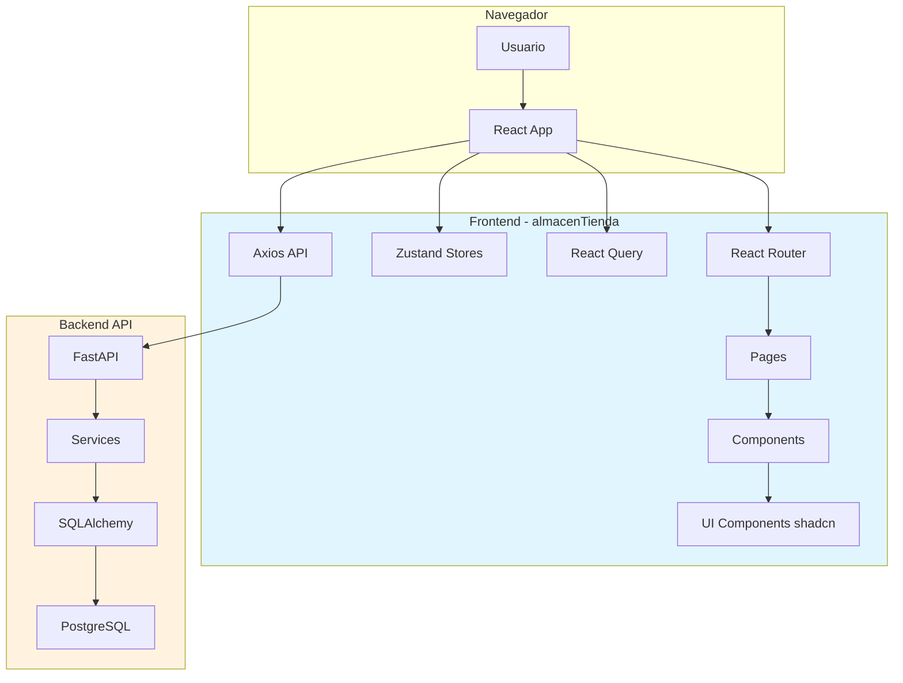

# Skill: almacen-frontend

## Descripción

Patrones y convenciones específicas para el desarrollo del frontend de almacenTienda.

## Cuándo Usar

Usar este skill cuando se trabaje en:
- Estructura general del frontend
- Configuración del proyecto React
- Organización de componentes y páginas
- Patrones de estado global
- Configuración de herramientas de desarrollo

## Flujo de Arquitectura del Frontend



## Estructura del Proyecto

```
src/
├── api/                    # Configuración Axios
│   ├── axios.ts           # Instancia configurada
│   └── endpoints/         # Endpoints por dominio
├── components/            # Componentes React
│   ├── ui/               # Componentes base shadcn
│   ├── layout/           # Layout components
│   └── domain/            # Componentes por dominio
├── pages/                 # Páginas de la app
├── hooks/                 # Custom hooks
├── stores/                # Zustand stores
├── lib/                   # Utilidades
├── types/                 # Tipos TypeScript
└── App.tsx               # Entry point
```

## Patrones de Código

### Estructura de un Componente

```tsx
import { useState } from 'react'
import { cn } from '@/lib/utils'
import { Button } from '@/components/ui/button'

interface Props {
  className?: string
  onAction: () => void
}

export function MiComponente({ className, onAction }: Props) {
  const [loading, setLoading] = useState(false)

  const handleClick = async () => {
    setLoading(true)
    try {
      await onAction()
    } finally {
      setLoading(false)
    }
  }

  return (
    <div className={cn("container", className)}>
      <Button onClick={handleClick} disabled={loading}>
        {loading ? 'Cargando...' : 'Acción'}
      </Button>
    </div>
  )
}
```

### Estructura de un Store Zustand

```tsx
import { create } from 'zustand'
import { persist } from 'zustand/middleware'

interface AppState {
  usuario: Usuario | null
  setUsuario: (usuario: Usuario | null) => void
  logout: () => void
}

export const useAppStore = create<AppState>()(
  persist(
    (set) => ({
      usuario: null,
      setUsuario: (usuario) => set({ usuario }),
      logout: () => set({ usuario: null }),
    }),
    { name: 'almacen-storage' }
  )
)
```

### Estructura de API con Axios

```tsx
// api/axios.ts
import axios from 'axios'

export const api = axios.create({
  baseURL: import.meta.env.VITE_API_URL || 'http://localhost:8000',
  timeout: 10000,
})

api.interceptors.request.use((config) => {
  const token = localStorage.getItem('token')
  if (token) {
    config.headers.Authorization = `Bearer ${token}`
  }
  return config
})

api.interceptors.response.use(
  (response) => response,
  (error) => {
    if (error.response?.status === 401) {
      localStorage.removeItem('token')
      window.location.href = '/login'
    }
    return Promise.reject(error)
  }
)
```

### Patrón de Página con React Query

```tsx
import { useQuery } from '@tanstack/react-query'
import { api } from '@/api/axios'
import { LoadingSpinner } from '@/components/ui/loading'

export function ListaProductos() {
  const { data, isLoading, error } = useQuery({
    queryKey: ['productos'],
    queryFn: () => api.get('/productos').then(res => res.data),
  })

  if (isLoading) return <LoadingSpinner />
  if (error) return <div>Error: {error.message}</div>

  return (
    <ul>
      {data.map((producto) => (
        <li key={producto.id}>{producto.nombre}</li>
      ))}
    </ul>
  )
}
```

## Reglas de Desarrollo

1. **Nunca usar `any`** - Usar tipos explícitos o `unknown`
2. **Siempre tipar los props** - Interfaces o types para componentes
3. **Usar `cn()`** - Para combinar clases de Tailwind
4. **Separar lógica** - Custom hooks para lógica reutilizable
5. **Estado servidor** - React Query para datos del backend
6. **Estado cliente** - Zustand para UI state
7. **Rutas protegidas** - Verificar autenticación en cada página
8. **Manejo de errores** - Siempre mostrar feedback al usuario

## Ejemplo de Ruta Protegida

```tsx
import { Navigate } from 'react-router'
import { useAppStore } from '@/stores/app'

export function ProtectedRoute({ children }: { children: React.ReactNode }) {
  const usuario = useAppStore((state) => state.usuario)
  
  if (!usuario) {
    return <Navigate to="/login" replace />
  }
  
  return children
}
```

## Recursos

- [React 19](../react-19/SKILL.md)
- [TypeScript](../typescript/SKILL.md)
- [Zustand 5](../zustand-5/SKILL.md)
- [Axios](../axios/SKILL.md)
