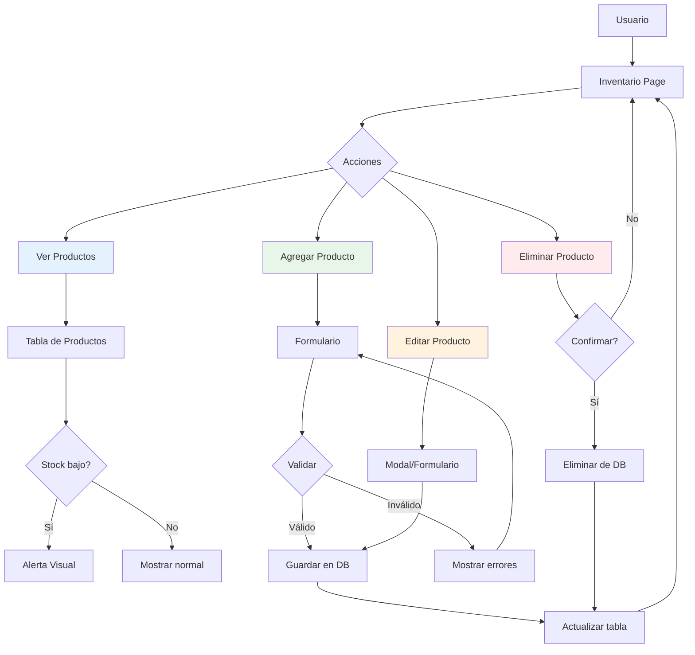

# Skill: almacen-inventory-ui

## Descripción

Patrones de UI para la gestión de inventario en almacenTienda.

## Cuándo Usar

Usar este skill cuando se trabaje en:
- Lista de productos
- Agregar/editar productos
- Control de stock
- Búsqueda y filtros de inventario
- Alertas de stock bajo

## Flujo de Gestión de Inventario



## Componentes de Inventario

### Tabla de Productos

```tsx
import { useState } from 'react'
import { useQuery, useMutation, useQueryClient } from '@tanstack/react-query'
import { api } from '@/api/axios'
import { DataTable } from '@/components/ui/data-table'
import { Button } from '@/components/ui/button'
import { Input } from '@/components/ui/input'
import { Badge } from '@/components/ui/badge'

interface Producto {
  id: number
  nombre: string
  codigo: string
  cantidad: number
  precio: number
  categoria: string
  stock_minimo: number
}

export function InventarioPage() {
  const queryClient = useQueryClient()
  const [search, setSearch] = useState('')
  
  const { data: productos, isLoading } = useQuery({
    queryKey: ['productos', search],
    queryFn: () => 
      api.get('/productos', { params: { search } })
        .then(res => res.data),
  })
  
  const deleteMutation = useMutation({
    mutationFn: (id: number) => api.delete(`/productos/${id}`),
    onSuccess: () => {
      queryClient.invalidateQueries({ queryKey: ['productos'] })
    },
  })
  
  const columns = [
    {
      accessorKey: 'codigo',
      header: 'Código',
    },
    {
      accessorKey: 'nombre',
      header: 'Nombre',
    },
    {
      accessorKey: 'categoria',
      header: 'Categoría',
      cell: ({ row }) => <Badge>{row.original.categoria}</Badge>,
    },
    {
      accessorKey: 'cantidad',
      header: 'Stock',
      cell: ({ row }) => {
        const stock = row.original.cantidad
        const min = row.original.stock_minimo
        const isLow = stock <= min
        return (
          <span className={isLow ? 'text-red-600 font-bold' : ''}>
            {stock}
            {isLow && <Badge variant="destructive" className="ml-2">Bajo</Badge>}
          </span>
        )
      },
    },
    {
      accessorKey: 'precio',
      header: 'Precio',
      cell: ({ row }) => `$${row.original.precio.toFixed(2)}`,
    },
    {
      id: 'actions',
      cell: ({ row }) => (
        <div className="flex gap-2">
          <Button 
            variant="outline" 
            size="sm"
            onClick={() => {/* Abrir modal编辑 */}}
          >
            Editar
          </Button>
          <Button 
            variant="destructive" 
            size="sm"
            onClick={() => deleteMutation.mutate(row.original.id)}
          >
            Eliminar
          </Button>
        </div>
      ),
    },
  ]
  
  return (
    <div className="space-y-4">
      <div className="flex justify-between items-center">
        <h1 className="text-2xl font-bold">Inventario</h1>
        <Button onClick={() => {/* Abrir modal创建 */}}>
          + Agregar Producto
        </Button>
      </div>
      
      <div className="flex gap-2">
        <Input
          placeholder="Buscar por código o nombre..."
          value={search}
          onChange={(e) => setSearch(e.target.value)}
          className="max-w-md"
        />
      </div>
      
      <DataTable
        columns={columns}
        data={productos || []}
        isLoading={isLoading}
      />
    </div>
  )
}
```

### Formulario de Producto

```tsx
import { useForm } from 'react-hook-form'
import { zodResolver } from '@hookform/resolvers/zod'
import { z } from 'zod'
import { Button } from '@/components/ui/button'
import { Input } from '@/components/ui/input'
import { Select } from '@/components/ui/select'

const productoSchema = z.object({
  nombre: z.string().min(1, 'El nombre es requerido'),
  codigo: z.string().min(1, 'El código es requerido'),
  categoria_id: z.number().min(1, 'Selecciona una categoría'),
  cantidad: z.number().int().min(0, 'La cantidad no puede ser negativa'),
  precio: z.number().positive('El precio debe ser positivo'),
  stock_minimo: z.number().int().min(0),
  descripcion: z.string().optional(),
})

type ProductoFormData = z.infer<typeof productoSchema>

interface Props {
  producto?: Producto
  onSubmit: (data: ProductoFormData) => Promise<void>
  onCancel: () => void
}

export function ProductoForm({ producto, onSubmit, onCancel }: Props) {
  const {
    register,
    handleSubmit,
    formState: { errors, isSubmitting },
  } = useForm<ProductoFormData>({
    resolver: zodResolver(productoSchema),
    defaultValues: producto || {
      nombre: '',
      codigo: '',
      categoria_id: 0,
      cantidad: 0,
      precio: 0,
      stock_minimo: 10,
      descripcion: '',
    },
  })
  
  return (
    <form onSubmit={handleSubmit(onSubmit)} className="space-y-4">
      <div className="grid grid-cols-2 gap-4">
        <div>
          <Input
            label="Código"
            {...register('codigo')}
            error={errors.codigo?.message}
          />
        </div>
        <div>
          <Input
            label="Nombre"
            {...register('nombre')}
            error={errors.nombre?.message}
          />
        </div>
        <div>
          <Input
            label="Categoría"
            type="number"
            {...register('categoria_id', { valueAsNumber: true })}
            error={errors.categoria_id?.message}
          />
        </div>
        <div>
          <Input
            label="Precio"
            type="number"
            step="0.01"
            {...register('precio', { valueAsNumber: true })}
            error={errors.precio?.message}
          />
        </div>
        <div>
          <Input
            label="Cantidad"
            type="number"
            {...register('cantidad', { valueAsNumber: true })}
            error={errors.cantidad?.message}
          />
        </div>
        <div>
          <Input
            label="Stock Mínimo"
            type="number"
            {...register('stock_minimo', { valueAsNumber: true })}
            error={errors.stock_minimo?.message}
          />
        </div>
      </div>
      
      <div className="flex justify-end gap-2">
        <Button type="button" variant="outline" onClick={onCancel}>
          Cancelar
        </Button>
        <Button type="submit" disabled={isSubmitting}>
          {isSubmitting ? 'Guardando...' : 'Guardar'}
        </Button>
      </div>
    </form>
  )
}
```

## Reglas de UI

1. **Stock bajo** - Mostrar alerta visual cuando cantidad <= stock_minimo
2. **Búsqueda en tiempo real** - Debounce de 300ms
3. **Confirmar eliminación** - Siempre pedir confirmación
4. **Feedback de carga** - Mostrar skeleton o spinner
5. **Validación inline** - Mostrar errores cerca del campo

## Recursos

- [React Query](../react-query/SKILL.md)
- [Zod](../zod/SKILL.md)
- [almacen-frontend](../almacen-frontend/SKILL.md)
