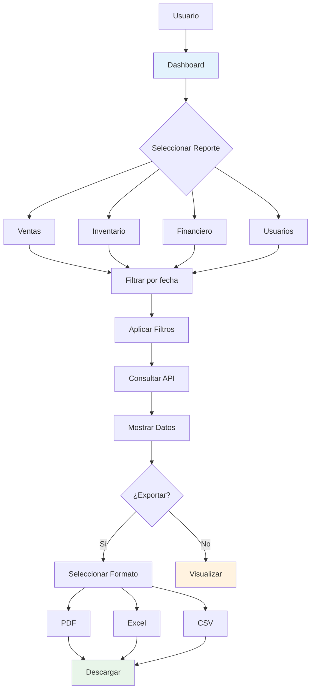

# Skill: almacen-reports-ui

## Descripción

Patrones de UI para reportes y analytics en almacenTienda.

## Cuándo Usar

Usar este skill cuando se trabaje en:
- Dashboard con métricas
- Gráficos de ventas
- Reportes de inventario
- Reportes financieros
- Exportación de datos

## Flujo de Reportes



## Componentes de Reportes

### Dashboard con Métricas

```tsx
import { useQuery } from '@tanstack/react-query'
import { api } from '@/api/axios'
import { Card, CardHeader, CardTitle, CardContent } from '@/components/ui/card'
import { 
  TrendingUp, 
  TrendingDown, 
  DollarSign, 
  Package, 
  Users,
  ShoppingCart 
} from 'lucide-react'

interface Metricas {
  ventas_hoy: number
  ventas_semana: number
  productos_stock_bajo: number
  total_usuarios: number
  porcentaje_cambio: number
}

export function DashboardPage() {
  const { data: metricas, isLoading } = useQuery({
    queryKey: ['metricas'],
    queryFn: () => api.get('/reportes/metricas').then(res => res.data),
  })
  
  const cards = [
    {
      title: 'Ventas Hoy',
      value: `$${metricas?.ventas_hoy?.toFixed(2) || '0.00'}`,
      icon: DollarSign,
      trend: metricas?.porcentaje_cambio,
    },
    {
      title: 'Ventas Semana',
      value: `$${metricas?.ventas_semana?.toFixed(2) || '0.00'}`,
      icon: ShoppingCart,
    },
    {
      title: 'Stock Bajo',
      value: metricas?.productos_stock_bajo || 0,
      icon: Package,
      alert: (metricas?.productos_stock_bajo || 0) > 0,
    },
    {
      title: 'Total Usuarios',
      value: metricas?.total_usuarios || 0,
      icon: Users,
    },
  ]
  
  return (
    <div className="space-y-6">
      <h1 className="text-2xl font-bold">Dashboard</h1>
      
      <div className="grid grid-cols-1 md:grid-cols-2 lg:grid-cols-4 gap-4">
        {cards.map((card, index) => (
          <Card key={index}>
            <CardHeader className="flex flex-row items-center justify-between pb-2">
              <CardTitle className="text-sm font-medium">
                {card.title}
              </CardTitle>
              <card.icon className="h-4 w-4 text-gray-500" />
            </CardHeader>
            <CardContent>
              <div className="text-2xl font-bold">{card.value}</div>
              {card.trend !== undefined && (
                <p className={`text-xs ${card.trend >= 0 ? 'text-green-600' : 'text-red-600'} flex items-center`}>
                  {card.trend >= 0 ? <TrendingUp className="h-3 w-3 mr-1" /> : <TrendingDown className="h-3 w-3 mr-1" />}
                  {Math.abs(card.trend)}% vs ayer
                </p>
              )}
              {card.alert && (
                <p className="text-xs text-red-600">Atención requerida</p>
              )}
            </CardContent>
          </Card>
        ))}
      </div>
    </div>
  )
}
```

### Gráfico de Ventas

```tsx
import { useQuery } from '@tanstack/react-query'
import { api } from '@/api/axios'
import { Card, CardHeader, CardTitle, CardContent } from '@/components/ui/card'

interface VentaDiaria {
  fecha: string
  total: number
}

export function GraficoVentas({ fechaInicio, fechaFin }: { fechaInicio: string, fechaFin: string }) {
  const { data: ventas } = useQuery({
    queryKey: ['ventas-grafico', fechaInicio, fechaFin],
    queryFn: () => 
      api.get('/reportes/ventas', { 
        params: { fecha_inicio: fechaInicio, fecha_fin: fechaFin } 
      }).then(res => res.data),
  })
  
  // Usar librería de gráficos como Recharts
  return (
    <Card>
      <CardHeader>
        <CardTitle>Ventas por Día</CardTitle>
      </CardHeader>
      <CardContent>
        {/* Implementar con Recharts */}
        <div className="h-[300px]">
          {/* BarChart o LineChart */}
        </div>
      </CardContent>
    </Card>
  )
}
```

### Tabla de Reporte Exportable

```tsx
import { useState } from 'react'
import { useQuery } from '@tanstack/react-query'
import { api } from '@/api/axios'
import { DataTable } from '@/components/ui/data-table'
import { Button } from '@/components/ui/button'
import { Download } from 'lucide-react'

interface ReporteVentas {
  id: number
  fecha: string
  producto: string
  cantidad: number
  precio: number
  total: number
}

export function ReporteVentas() {
  const [fechaInicio, setFechaInicio] = useState('')
  const [fechaFin, setFechaFin] = useState('')
  
  const { data, isLoading } = useQuery({
    queryKey: ['reporte-ventas', fechaInicio, fechaFin],
    queryFn: () => 
      api.get('/reportes/ventas', { 
        params: { fecha_inicio: fechaInicio, fecha_fin: fechaFin } 
      }).then(res => res.data),
    enabled: !!fechaInicio && !!fechaFin,
  })
  
  const exportarExcel = async () => {
    const response = await api.get('/reportes/ventas/export', {
      params: { fecha_inicio: fechaInicio, fecha_fin: fechaFin },
      responseType: 'blob',
    })
    const url = window.URL.createObjectURL(new Blob([response.data]))
    const link = document.createElement('a')
    link.href = url
    link.setAttribute('download', 'reporte_ventas.xlsx')
    document.body.appendChild(link)
    link.click()
  }
  
  const columns = [
    { accessorKey: 'fecha', header: 'Fecha' },
    { accessorKey: 'producto', header: 'Producto' },
    { accessorKey: 'cantidad', header: 'Cantidad' },
    { accessorKey: 'precio', header: 'Precio Unitario' },
    { accessorKey: 'total', header: 'Total' },
  ]
  
  return (
    <div className="space-y-4">
      <div className="flex gap-4">
        <input
          type="date"
          value={fechaInicio}
          onChange={(e) => setFechaInicio(e.target.value)}
        />
        <input
          type="date"
          value={fechaFin}
          onChange={(e) => setFechaFin(e.target.value)}
        />
        <Button onClick={exportarExcel}>
          <Download className="h-4 w-4 mr-2" />
          Exportar
        </Button>
      </div>
      
      <DataTable columns={columns} data={data || []} isLoading={isLoading} />
    </div>
  )
}
```

## Reglas de UI

1. **Carga progresiva** - Mostrar skeleton mientras cargan datos
2. **Fechas por defecto** - Últimos 30 días al iniciar
3. **Gráficos claros** - Títulos y leyendas legibles
4. **Exportación** - Siempre ofrecer opción de PDF/Excel
5. **Responsive** - Adaptar gráficos a pantalla móvil

## Recursos

- [React Query](../react-query/SKILL.md)
- [almacen-sales-ui](../almacen-sales-ui/SKILL.md)
