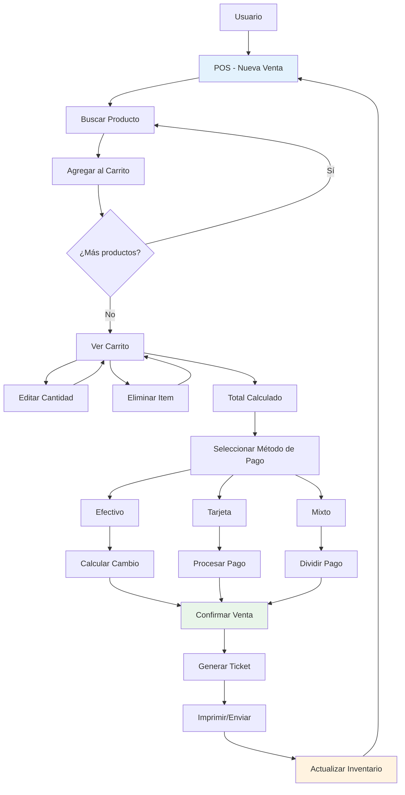

# Skill: almacen-sales-ui

## Descripción

Patrones de UI para el sistema de ventas (POS) en almacenTienda.

## Cuándo Usar

Usar este skill cuando se trabaje en:
- Punto de venta (POS)
- Carrito de compras
- Cobro y pagos
- Ticket/boleta de venta
- Historial de ventas

## Flujo de Ventas



## Componentes de POS

### Página de Punto de Venta

```tsx
import { useState, useMemo } from 'react'
import { useQuery } from '@tanstack/react-query'
import { api } from '@/api/axios'
import { Button } from '@/components/ui/button'
import { Input } from '@/components/ui/input'
import { Card, CardHeader, CardTitle, CardContent } from '@/components/ui/card'

interface Producto {
  id: number
  nombre: string
  precio: number
  stock: number
}

interface CarritoItem extends Producto {
  cantidad: number
}

export function POSPage() {
  const [search, setSearch] = useState('')
  const [carrito, setCarrito] = useState<CarritoItem[]>([])
  
  const { data: productos } = useQuery({
    queryKey: ['productos', 'disponibles'],
    queryFn: () => api.get('/productos/disponibles').then(res => res.data),
  })
  
  const productosFiltrados = useMemo(() => {
    if (!productos) return []
    return productos.filter(p => 
      p.nombre.toLowerCase().includes(search.toLowerCase()) ||
      p.codigo?.toLowerCase().includes(search.toLowerCase())
    )
  }, [productos, search])
  
  const agregarAlCarrito = (producto: Producto) => {
    setCarrito(prev => {
      const existente = prev.find(p => p.id === producto.id)
      if (existente) {
        return prev.map(p => 
          p.id === producto.id 
            ? { ...p, cantidad: p.cantidad + 1 }
            : p
        )
      }
      return [...prev, { ...producto, cantidad: 1 }]
    })
  }
  
  const actualizarCantidad = (id: number, cantidad: number) => {
    if (cantidad <= 0) {
      setCarrito(prev => prev.filter(p => p.id !== id))
    } else {
      setCarrito(prev => p.map(p => p.id === id ? { ...p, cantidad } : p))
    }
  }
  
  const eliminarDelCarrito = (id: number) => {
    setCarrito(prev => prev.filter(p => p.id !== id))
  }
  
  const total = useMemo(() => 
    carrito.reduce((sum, item) => sum + (item.precio * item.cantidad), 0),
    [carrito]
  )
  
  const handleFinalizarVenta = async () => {
    const venta = {
      items: carrito.map(p => ({ producto_id: p.id, cantidad: p.cantidad })),
      total,
    }
    await api.post('/ventas', venta)
    setCarrito([])
    // Mostrar ticket
  }
  
  return (
    <div className="grid grid-cols-3 gap-4 h-[calc(100vh-100px)]">
      {/* Panel de Productos */}
      <div className="col-span-2 space-y-4">
        <Input
          placeholder="Buscar producto..."
          value={search}
          onChange={(e) => setSearch(e.target.value)}
        />
        
        <div className="grid grid-cols-4 gap-2 overflow-y-auto">
          {productosFiltrados.map(producto => (
            <Card 
              key={producto.id} 
              className="cursor-pointer hover:ring-2"
              onClick={() => agregarAlCarrito(producto)}
            >
              <CardContent className="p-3">
                <p className="font-medium truncate">{producto.nombre}</p>
                <p className="text-lg font-bold text-green-600">
                  ${producto.precio.toFixed(2)}
                </p>
                <p className="text-xs text-gray-500">
                  Stock: {producto.stock}
                </p>
              </CardContent>
            </Card>
          ))}
        </div>
      </div>
      
      {/* Panel del Carrito */}
      <Card>
        <CardHeader>
          <CardTitle>Carrito</CardTitle>
        </CardHeader>
        <CardContent className="flex flex-col h-full">
          <div className="flex-1 overflow-y-auto space-y-2">
            {carrito.map(item => (
              <div key={item.id} className="flex justify-between items-center p-2 border rounded">
                <div>
                  <p className="font-medium">{item.nombre}</p>
                  <p className="text-sm text-gray-500">${item.precio}</p>
                </div>
                <div className="flex items-center gap-2">
                  <Button 
                    size="sm" 
                    variant="outline"
                    onClick={() => actualizarCantidad(item.id, item.cantidad - 1)}
                  >
                    -
                  </Button>
                  <span>{item.cantidad}</span>
                  <Button 
                    size="sm" 
                    variant="outline"
                    onClick={() => actualizarCantidad(item.id, item.cantidad + 1)}
                  >
                    +
                  </Button>
                </div>
              </div>
            ))}
          </div>
          
          <div className="border-t pt-4 mt-4">
            <div className="flex justify-between text-xl font-bold">
              <span>Total:</span>
              <span>${total.toFixed(2)}</span>
            </div>
            <Button 
              className="w-full mt-4" 
              size="lg"
              onClick={handleFinalizarVenta}
              disabled={carrito.length === 0}
            >
              Finalizar Venta
            </Button>
          </div>
        </CardContent>
      </Card>
    </div>
  )
}
```

### Componente de Pago

```tsx
import { useState } from 'react'
import { Dialog, DialogContent, DialogHeader, DialogTitle } from '@/components/ui/dialog'
import { Button } from '@/components/ui/button'
import { Input } from '@/components/ui/input'

interface Props {
  open: boolean
  total: number
  onConfirm: (pago: { metodo: string; monto: number }) => void
  onClose: () => void
}

export function ModalPago({ open, total, onConfirm, onClose }: Props) {
  const [metodoPago, setMetodoPago] = useState<'efectivo' | 'tarjeta'>('efectivo')
  const [montoRecibido, setMontoRecibido] = useState(total)
  
  const cambio = montoRecibido - total
  
  const handleConfirm = () => {
    onConfirm({ metodo: metodoPago, monto: montoRecibido })
  }
  
  return (
    <Dialog open={open} onOpenChange={onClose}>
      <DialogContent>
        <DialogHeader>
          <DialogTitle>Confirmar Pago</DialogTitle>
        </DialogHeader>
        
        <div className="space-y-4">
          <div className="text-2xl font-bold text-center">
            Total: ${total.toFixed(2)}
          </div>
          
          <div className="flex gap-2">
            <Button
              variant={metodoPago === 'efectivo' ? 'default' : 'outline'}
              onClick={() => setMetodoPago('efectivo')}
              className="flex-1"
            >
              Efectivo
            </Button>
            <Button
              variant={metodoPago === 'tarjeta' ? 'default' : 'outline'}
              onClick={() => setMetodoPago('tarjeta')}
              className="flex-1"
            >
              Tarjeta
            </Button>
          </div>
          
          {metodoPago === 'efectivo' && (
            <div>
              <label className="text-sm font-medium">Monto Recibido</label>
              <Input
                type="number"
                value={montoRecibido}
                onChange={(e) => setMontoRecibido(Number(e.target.value))}
                className="text-lg"
              />
              {cambio >= 0 && (
                <p className="text-green-600 font-bold mt-2">
                  Cambio: ${cambio.toFixed(2)}
                </p>
              )}
            </div>
          )}
          
          <Button 
            className="w-full" 
            size="lg"
            onClick={handleConfirm}
            disabled={metodoPago === 'efectivo' && montoRecibido < total}
          >
            Confirmar Venta
          </Button>
        </div>
      </DialogContent>
    </Dialog>
  )
}
```

## Reglas de UI

1. **Actualización instantánea** - El total cambia al modificar cantidades
2. **Stock en tiempo real** - Verificar disponibilidad antes de agregar
3. **Atajos de teclado** - Agregar con Enter, buscar con Ctrl+F
4. **Confirmación clara** - Mostrar resumen antes de confirmar
5. **Ticket generado** - Siempre generar ticket después de venta

## Recursos

- [almacen-inventory-ui](../almacen-inventory-ui/SKILL.md)
- [React Query](../react-query/SKILL.md)
