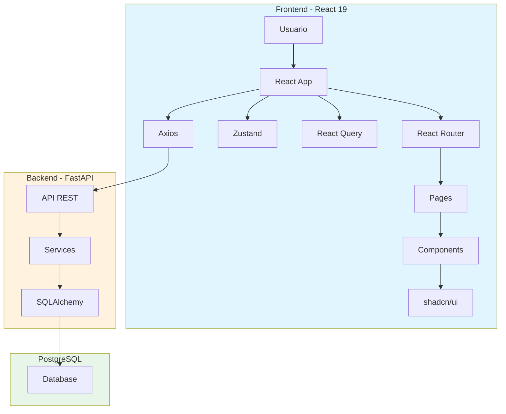

# almacenTienda - Sistema de Gestión de Inventario

<p align="center">
  
  
  
  
  
</p>

---

## 📋 Descripción

**almacenTienda** es un sistema de gestión de inventario para tiendas, desarrollado como aplicación web full-stack para controlar inventario, ventas, caja y usuarios.

## 🏗️ Arquitectura



## 🛠️ Tech Stack

### Frontend
| Tecnología | Propósito |
|------------|-----------|
| React 19 | Framework UI |
| TypeScript | Tipado estático |
| Vite | Build tool |
| bun | Package manager |
| TailwindCSS | Estilos |
| shadcn/ui | Componentes UI |
| Zustand | Estado global |
| React Query | Estado servidor |
| Axios | HTTP client |
| React Router | Routing |

### Backend
| Tecnología | Propósito |
|------------|-----------|
| FastAPI | Framework API |
| Python 3.12 | Lenguaje |
| SQLAlchemy | ORM |
| PostgreSQL | Base de datos |
| JWT | Autenticación |
| Pydantic | Validación |
| Alembic | Migraciones |

### DevOps
| Tecnología | Propósito |
|------------|-----------|
| Docker | Containerización |
| Nginx | Servidor web |

## 🚀 Inicio Rápido

### Con Docker Compose

```bash
# 1. Clonar el repositorio
git clone https://github.com/Jesus-piedrahita/almacentienda.git
cd almacentienda

# 2. Copiar variables de entorno
cp .env.example .env

# 3. Iniciar servicios
docker-compose up -d

# 4. Acceder a la aplicación
# Frontend: http://localhost:8080
# Backend:  http://localhost:8000
# API Docs: http://localhost:8000/docs
```

### Desarrollo Local

```bash
# Frontend
cd almacenTienda
bun install
bun run dev

# Backend
cd backendTienda
pip install -r requirements.txt
uvicorn app.main:app --reload
```

## 📁 Estructura del Proyecto

```
almacentienda/
├── almacenTienda/           # Frontend React
│   ├── src/                # Código fuente
│   │   ├── components/    # Componentes
│   │   ├── pages/         # Páginas
│   │   ├── hooks/         # Custom hooks
│   │   ├── stores/        # Zustand stores
│   │   ├── api/           # Config Axios
│   │   └── lib/           # Utilidades
│   ├── .agents/           # Skills para agentes
│   ├── Dockerfile
│   └── nginx.conf
│
├── backendTienda/          # Backend FastAPI
│   ├── app/               # Aplicación
│   │   ├── routers/       # Endpoints
│   │   ├── services/      # Lógica de negocio
│   │   ├── models/       # Modelos DB
│   │   ├── schemas/      # Schemas Pydantic
│   │   └── main.py       # Entry point
│   ├── .agents/           # Skills para agentes
│   ├── Dockerfile
│   └── requirements.txt
│
├── docker-compose.yml      # Orquestación
├── .env.example          # Variables de entorno
└── Makefile              # Comandos útiles
```

## 📄 Documentación

- [AGENTS.md](./AGENTS.md) - Guías y skills del proyecto
- [docs/](./docs/) - Documentación adicional

## 🤝 Contribuciones

1. Fork el repositorio
2. Crea una rama (`git checkout -b feature/nueva-funcionalidad`)
3. Commit tus cambios (`git commit -m 'feat: agregar nueva funcionalidad'`)
4. Push a la rama (`git push origin feature/nueva-funcionalidad`)
5. Abre un Pull Request

## 📝 License

Este proyecto está bajo la licencia MIT.

---

<p align="center">Desarrollado con ❤️ para tiendas locales</p>
