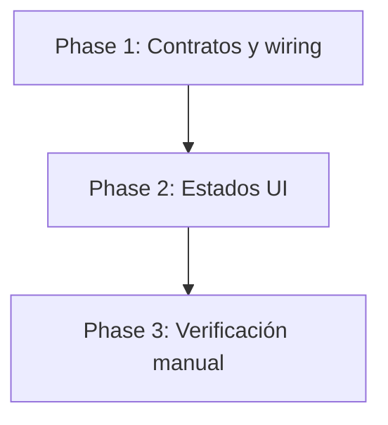
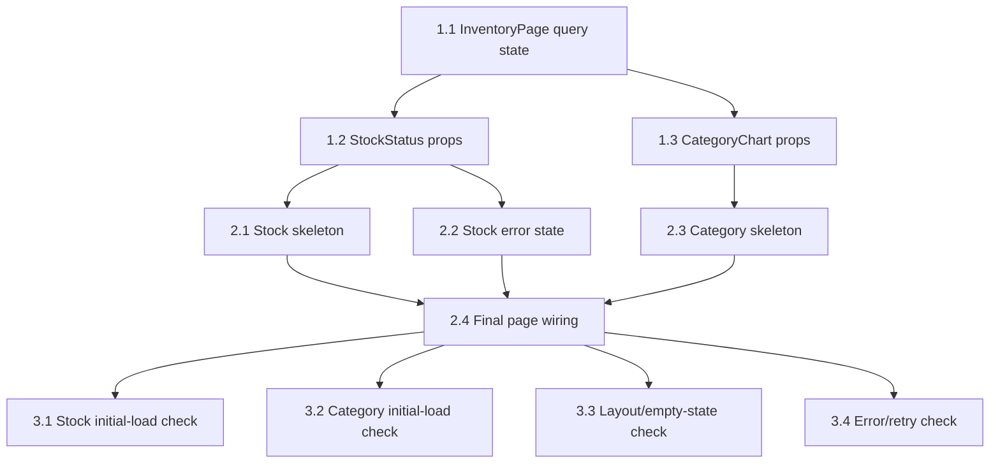

# Tasks: Fix Stock Status Initial Load

## Phase 1: Contratos y wiring

- [x] 1.1 Actualizar `almacenTienda/src/pages/inventory-page.tsx` para extraer `isError` y `refetch` desde `useInventoryStats()`, separar el estado inicial de carga del estado vacío real y preparar los props que se enviarán a `StockStatusIndicator` y `CategoryChart`.
- [x] 1.2 Actualizar la interfaz de `almacenTienda/src/components/inventory/stock-status-indicator.tsx` para aceptar `isLoading`, `isError` y `onRetry`, manteniendo el contrato de datos cargados (`good`, `warning`, `critical`).
- [x] 1.3 Actualizar la interfaz de `almacenTienda/src/components/inventory/category-chart.tsx` para aceptar `isLoading` sin romper el empty state actual cuando ya no hay carga.

## Phase 2: Estados UI

- [x] 2.1 Implementar en `almacenTienda/src/components/inventory/stock-status-indicator.tsx` un early return de skeleton con `animate-pulse` que replique barra de progreso, grilla de 3 cards y línea contextual, respetando la altura esperada del componente cargado.
- [x] 2.2 Implementar en `almacenTienda/src/components/inventory/stock-status-indicator.tsx` un estado de error claro con acción de retry (`onRetry`) y conservar los estados actuales de empty / warning / critical / healthy cuando hay datos válidos.
- [x] 2.3 Implementar en `almacenTienda/src/components/inventory/category-chart.tsx` un early return de skeleton con 3-4 filas de barras y resumen final, evitando que aparezca el mensaje "No hay categorías con productos" durante la carga inicial.
- [x] 2.4 Completar el wiring en `almacenTienda/src/pages/inventory-page.tsx` para pasar `isLoading`, `isError`, `onRetry` y los valores reales de stats a cada componente solo cuando corresponda, eliminando el flash inicial de `0 / 0 / 0` y listas vacías falsas.

## Phase 3: Verificación manual

- [ ] 3.1 Verificar manualmente en la página `almacenTienda/src/pages/inventory-page.tsx` que `StockStatusIndicator` muestre skeleton en la primera carga (sin cache / red lenta) en lugar de `0 / 0 / 0`.
- [ ] 3.2 Verificar manualmente en la página `almacenTienda/src/pages/inventory-page.tsx` que `CategoryChart` muestre skeleton en la primera carga y que no aparezca el texto "No hay categorías con productos" antes de tiempo.
- [ ] 3.3 Verificar manualmente que ambos skeletons sean reemplazados por datos reales sin layout shift perceptible y que el empty state legítimo siga funcionando cuando las estadísticas devuelven cero productos.
- [ ] 3.4 Verificar manualmente que, ante fallo de `/api/inventory/stats`, `StockStatusIndicator` muestre error con retry y que el retry recupere el contenido cuando la request vuelva a responder.

## Dependencies entre Tasks

## Notas

- Este breakdown asume que el estado de error + retry para `StockStatusIndicator` sigue **en scope** porque aparece en `proposal.md` y `specs/ui/spec.md`.
- El `design.md` disponible hoy solo documenta `isLoading`; antes de `/sdd:apply` conviene alinear ese artefacto con proposal/spec o aceptar explícitamente que el diseño quedó incompleto respecto del manejo de error.
