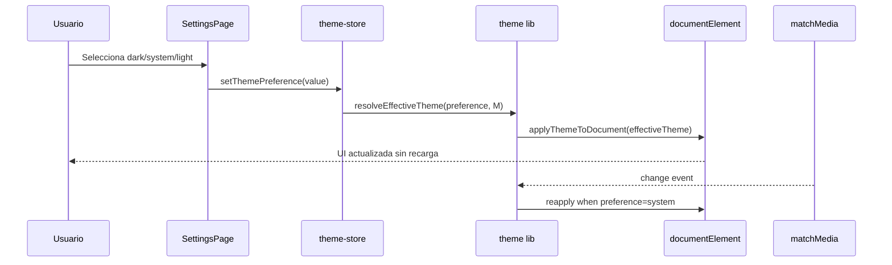
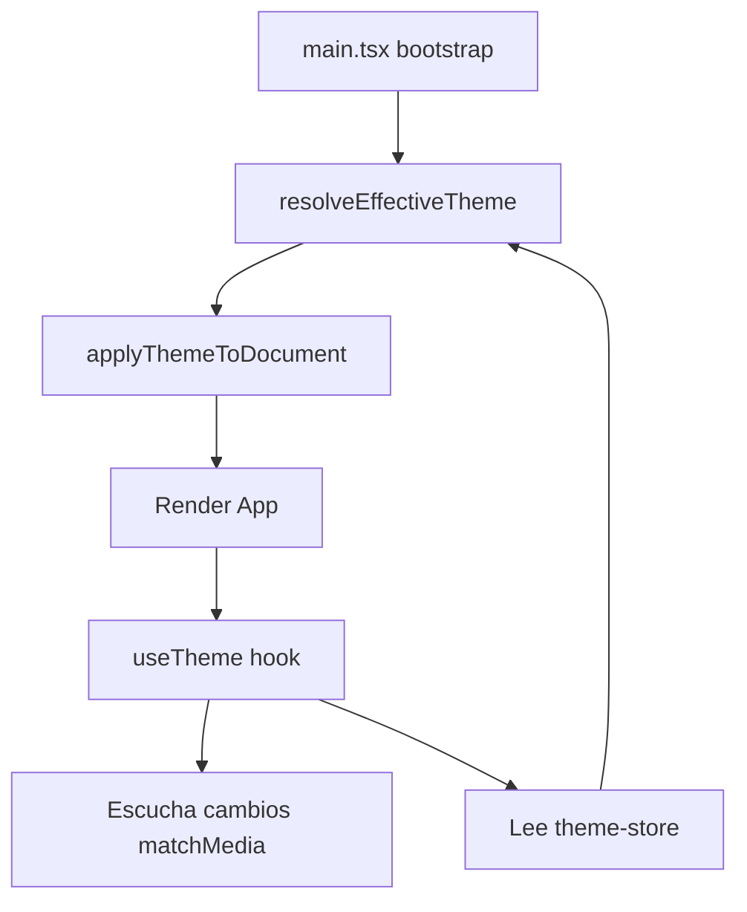

# Design: Global Theme System

## Technical Approach

El frontend ya tiene la base visual del tema en `src/index.css` mediante tokens para `:root` y `.dark`, pero no existe una infraestructura funcional para decidir qué tema usar. La implementación propuesta agrega una capa pequeña en tres partes: utilidades puras para resolver/aplicar el tema, un store persistido para recordar la preferencia y un hook de sincronización para reaccionar a cambios del sistema cuando la preferencia sea `system`.

La aplicación inicial del tema debe ocurrir en el bootstrap (`src/main.tsx`) para evitar flash visual. Luego, durante la vida de la app, el hook se encargará de mantener sincronizados store, DOM y preferencias del sistema.

## Architecture Decisions

### Decision: Store global persistido con Zustand

**Choice**: Guardar la preferencia de tema en un store de Zustand persistido.
**Alternatives considered**: local state en `App.tsx`, React Context dedicado, solo `localStorage` sin store.
**Rationale**: El proyecto ya usa Zustand como patrón global. Mantener el tema en esa misma capa reduce conceptos nuevos y permite exponer selectores estables a cualquier pantalla futura.

### Decision: No usar `next-themes`

**Choice**: Implementar un engine propio de tema apoyado en Zustand + utilidades puras + clase `.dark`.
**Alternatives considered**: adoptar `next-themes` como wrapper principal.
**Rationale**: Aunque shadcn/ui suele documentar dark mode con `next-themes`, este proyecto usa Vite + React + Zustand y ya dispone de tokens CSS y variant `dark` listos en `src/index.css`. Sumar `next-themes` introduciría una capa extra innecesaria donde el problema real ya está bien acotado.

### Decision: Resolver y aplicar el tema desde una capa utilitaria separada

**Choice**: Centralizar la lógica en `src/lib/theme.ts` con funciones puras como resolución de preferencia y aplicación al documento.
**Alternatives considered**: poner toda la lógica dentro del hook o dentro del store.
**Rationale**: Separar utilidades puras facilita testear los casos críticos del sistema de tema sin acoplarlos a React ni al store.

### Decision: Settings como primer punto de control de UI

**Choice**: Exponer el selector inicial de tema dentro de `src/pages/settings-page.tsx`.
**Alternatives considered**: toggle inmediato en sidebar, modal global, controles por pantalla.
**Rationale**: `Configuración` ya es la superficie natural para preferencias globales. Esto minimiza cambios de navegación y evita duplicar controles antes de validar el flujo base.

### Decision: Bootstrap temprano del tema

**Choice**: Aplicar el tema antes del render principal en `src/main.tsx` usando la misma utilidad central.
**Alternatives considered**: esperar a `useEffect` en `App.tsx` o aplicar solo después del montaje.
**Rationale**: Si el tema se aplica tarde, el usuario ve primero la versión incorrecta. El bootstrap temprano reduce ese FOUC sin introducir dependencias extra.

## Data Flow

```text
Browser boot
    |
    v
read persisted theme preference
    |
    v
resolve effective theme <---- matchMedia(prefers-color-scheme)
    |
    v
apply theme to documentElement
    |
    v
React renders app with correct CSS token set
    |
    v
SettingsPage updates preference ---> theme-store ---> resolve/apply again
```

## Sequence Diagram



## File Changes

| File | Action | Description |
|------|--------|-------------|
| `src/lib/theme.ts` | Create | Funciones puras para resolver tema efectivo y aplicarlo al DOM |
| `src/stores/theme-store.ts` | Create | Store persistido con `themePreference` y selectores relacionados |
| `src/hooks/use-theme.ts` | Create | Hook para sincronización continua con `matchMedia` y DOM |
| `src/main.tsx` | Modify | Aplicación temprana del tema antes del render de React |
| `src/App.tsx` | Modify | Montaje del hook global de tema una vez por app |
| `src/pages/settings-page.tsx` | Modify | Sección UI para selección de tema |
| `src/index.css` | Modify | Ajustes mínimos del contrato CSS global si hiciera falta para `color-scheme` |
| `src/lib/theme.test.ts` | Create | Tests de resolución y aplicación del tema |
| `src/pages/settings-page.test.tsx` | Modify | Verificar interacción del selector de tema |

## Interfaces / Contracts

```ts
export type ThemePreference = 'light' | 'dark' | 'system'
export type EffectiveTheme = 'light' | 'dark'

export interface ThemeState {
  themePreference: ThemePreference
  setThemePreference: (value: ThemePreference) => void
}

export function resolveEffectiveTheme(
  preference: ThemePreference,
  systemPrefersDark: boolean,
): EffectiveTheme

export function applyThemeToDocument(theme: EffectiveTheme): void
```

## Testing Strategy

| Layer | What to Test | Approach |
|-------|-------------|----------|
| Unit | Resolución `light`/`dark`/`system` | Testear `resolveEffectiveTheme()` con combinaciones explícitas |
| Unit | Sincronización del DOM | Testear `applyThemeToDocument()` sobre `document.documentElement` |
| Integration | Persistencia en store | Verificar que la preferencia sobreviva a recreación del store/bootstrap |
| Integration | Settings UI | Verificar que cambiar la opción de tema actualiza el estado y el DOM |

## Migration / Rollout

No migration required. El cambio es puramente frontend y no requiere datos backend. El rollout puede ser directo porque reutiliza tokens CSS ya presentes y agrega una capa funcional encima.

## Open Questions

- [ ] ¿Conviene agregar un indicador visual del tema efectivo cuando la preferencia elegida sea `system`?

## Flow Diagram


