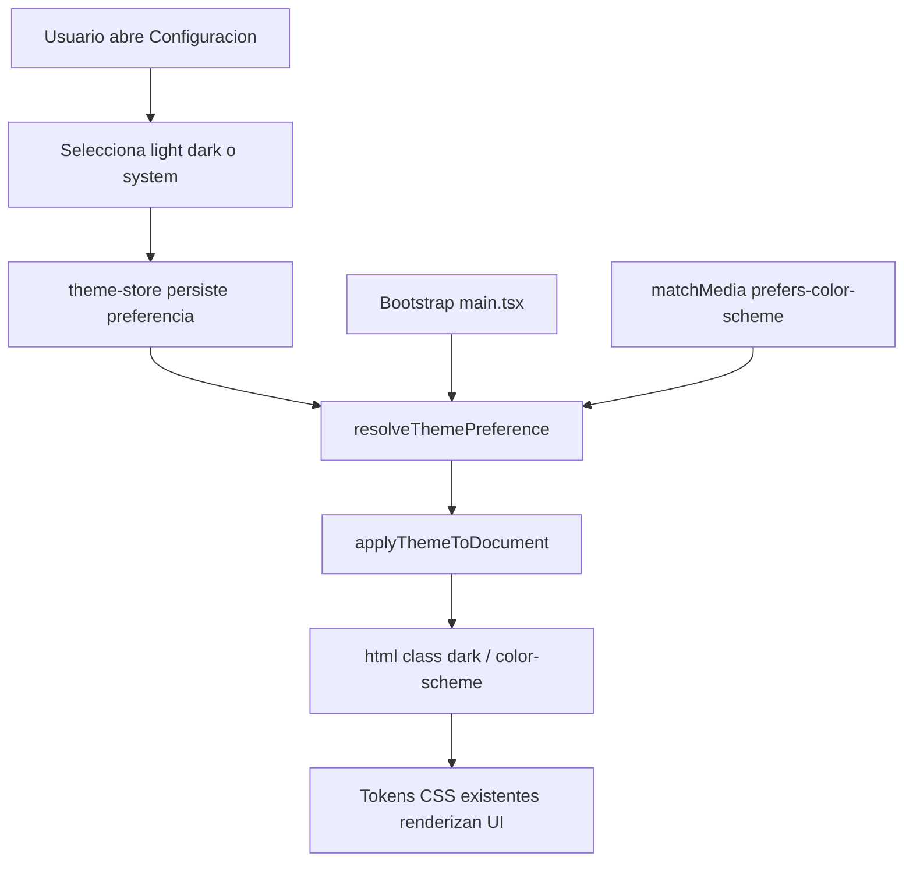

# Proposal: Global Theme System

## Intent

Implementar un sistema global de tema para el frontend que permita elegir entre `light`, `dark` y `system`, persistir la preferencia del usuario y aplicar el tema real en toda la aplicación sin parpadeos visuales ni lógica duplicada por componente. Hoy el proyecto ya tiene tokens CSS para `:root` y `.dark` en `src/index.css`, pero no existe una capa funcional que decida, persista y sincronice el tema activo.

## Scope

### In Scope
- Crear una capa global de tema con preferencias `light`, `dark` y `system`
- Persistir la preferencia del tema entre recargas y sesiones
- Resolver el tema efectivo según `matchMedia('(prefers-color-scheme: dark)')` cuando la preferencia sea `system`
- Aplicar la clase de tema y `color-scheme` sobre el documento raíz de forma centralizada
- Exponer controles de tema desde la UI existente de `Configuración`
- Evitar flash visual inicial del tema incorrecto al cargar la app
- Cubrir la lógica crítica con tests unitarios/integración frontend

### Out of Scope
- Rediseñar la paleta visual completa del producto
- Crear múltiples temas de marca o presets por módulo
- Persistir la preferencia de tema en backend
- Añadir librerías externas de theming

## Approach

Se implementará una capa pequeña y centralizada de tema sobre la infraestructura actual de tokens CSS. La preferencia del usuario vivirá en un store global persistido; una utilidad/hook resolverá el tema efectivo y sincronizará `document.documentElement` con la clase `dark` y la propiedad `color-scheme`. Para minimizar FOUC, el tema se aplicará lo más temprano posible durante el bootstrap del frontend. La UI de `Configuración` será el punto inicial de gestión del tema para no introducir controles duplicados antes de validar el flujo global.

La implementación seguirá el enfoque recomendado para este proyecto: **engine propio con Zustand**,
compatible con el sistema de tokens y la clase `.dark` ya usados por shadcn/ui. No se adoptará
`next-themes` ni otra librería de theming, porque el proyecto ya cuenta con la infraestructura visual
base y sólo necesita el motor de resolución, persistencia y sincronización.

## Affected Areas

| Area | Impact | Description |
|------|--------|-------------|
| `src/index.css` | Modified | Consolidar contrato CSS del tema global y asegurar compatibilidad con `color-scheme` |
| `src/main.tsx` | Modified | Aplicar el tema inicial antes del render principal |
| `src/pages/settings-page.tsx` | Modified | Agregar controles para cambiar preferencia de tema |
| `src/stores/theme-store.ts` | New | Store persistido para preferencia y tema efectivo |
| `src/hooks/use-theme.ts` | New | Hook para resolver y sincronizar el tema con el DOM |
| `src/lib/theme.ts` | New | Utilidades puras para resolver/aplicar tema |
| `src/**/*.test.ts(x)` | New/Modified | Cobertura de persistencia, resolución y aplicación del tema |

## Risks

| Risk | Likelihood | Mitigation |
|------|------------|------------|
| Flash inicial con tema incorrecto | Medium | Aplicar tema en bootstrap antes del render de React |
| Desincronización entre store y DOM | Medium | Mantener una sola función de aplicación del tema reutilizada por bootstrap y hook |
| Estados inconsistentes al usar preferencia `system` | Low | Escuchar `matchMedia` solo desde una capa central y testear cambios de preferencia del sistema |

## Rollback Plan

1. Remover el store, hook y utilidades del sistema de tema global
2. Revertir la sección de tema en `src/pages/settings-page.tsx`
3. Volver al comportamiento actual basado únicamente en tokens CSS estáticos y ausencia de selector de tema

## Dependencies

- React 19
- Zustand 5
- React Router 7
- TailwindCSS 4 con tokens ya definidos en `src/index.css`
- shadcn/ui basado en CSS variables y clase `.dark`

## Success Criteria

- [ ] El usuario puede elegir `light`, `dark` o `system` desde la UI de configuración
- [ ] La preferencia se restaura correctamente después de recargar la aplicación
- [ ] Cuando la preferencia es `system`, la app sigue el esquema del sistema operativo/navegador
- [ ] El documento raíz refleja siempre el tema efectivo correcto mediante clase y `color-scheme`
- [ ] La carga inicial evita mostrar el tema equivocado de forma perceptible
- [ ] No se agregan dependencias externas para resolver el theming

## Flow Diagram

