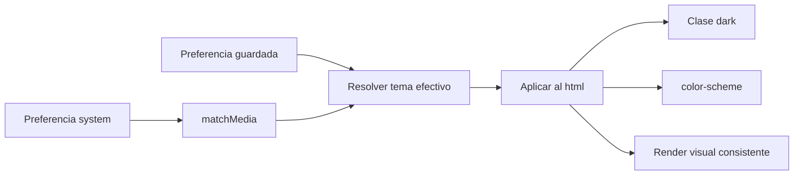

# UI Specification

## Purpose

Definir el comportamiento del sistema global de tema del frontend para que la aplicación pueda resolver, persistir y aplicar una preferencia visual consistente en todas las pantallas.

## Requirements

### Requirement: Global Theme Preference

La aplicación MUST permitir una preferencia global de tema con los valores `light`, `dark` y `system`.

#### Scenario: Usuario consulta las opciones de tema

- GIVEN un usuario autenticado dentro de la aplicación
- WHEN navega a la pantalla de configuración
- THEN la interfaz MUST mostrar las opciones `light`, `dark` y `system`
- AND la opción activa MUST estar claramente identificada

### Requirement: Theme Preference Persistence

La aplicación MUST persistir la preferencia global de tema para restaurarla después de una recarga.

#### Scenario: Restauración tras recarga

- GIVEN que el usuario seleccionó el tema `dark`
- WHEN recarga la aplicación
- THEN la aplicación MUST restaurar la preferencia `dark`
- AND la UI MUST renderizarse usando el tema efectivo correspondiente

### Requirement: System Theme Resolution

La aplicación MUST resolver el tema efectivo a partir de la preferencia del usuario y SHOULD seguir la preferencia del sistema cuando el modo seleccionado sea `system`.

#### Scenario: Preferencia system con sistema oscuro

- GIVEN que la preferencia guardada es `system`
- AND el sistema operativo o navegador reporta esquema oscuro
- WHEN la aplicación calcula el tema efectivo
- THEN el tema efectivo MUST ser `dark`

#### Scenario: Cambio del sistema mientras la app esta abierta

- GIVEN que la preferencia guardada es `system`
- AND la aplicación ya está abierta
- WHEN el sistema operativo o navegador cambia de `light` a `dark`
- THEN la aplicación SHOULD actualizar el tema efectivo sin recarga manual

### Requirement: Root Document Theme Synchronization

La aplicación MUST aplicar el tema efectivo al documento raíz mediante una única capa centralizada.

#### Scenario: Aplicación del tema oscuro

- GIVEN que el tema efectivo resuelto es `dark`
- WHEN la sincronización con el DOM ocurre
- THEN `document.documentElement` MUST incluir la clase `dark`
- AND el documento MUST exponer `color-scheme: dark`

#### Scenario: Aplicación del tema claro

- GIVEN que el tema efectivo resuelto es `light`
- WHEN la sincronización con el DOM ocurre
- THEN `document.documentElement` MUST NOT incluir la clase `dark`
- AND el documento MUST exponer `color-scheme: light`

### Requirement: Early Theme Application

La aplicación SHOULD aplicar el tema inicial antes del primer render visible para evitar flash del tema equivocado.

#### Scenario: Carga inicial con preferencia persistida

- GIVEN que existe una preferencia persistida de tema
- WHEN la aplicación arranca en el navegador
- THEN el tema efectivo SHOULD aplicarse antes de que el usuario perciba el primer render principal

### Requirement: Theme Controls in Settings

La pantalla de configuración MUST ser capaz de modificar la preferencia global de tema sin requerir recarga manual.

#### Scenario: Cambio manual a tema claro

- GIVEN que el usuario está en la pantalla de configuración
- WHEN selecciona la opción `light`
- THEN la aplicación MUST actualizar inmediatamente el tema efectivo a `light`
- AND la preferencia persistida MUST actualizarse al nuevo valor

## Additional Diagram

