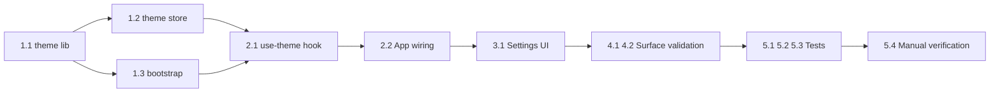

# Tasks: Global Theme System

## Layer 1: Theme foundation

- [x] 1.1 Create `src/lib/theme.ts` with `ThemePreference`, `EffectiveTheme`, `resolveEffectiveTheme()` and `applyThemeToDocument()` so the theme contract lives in one reusable module.
- [x] 1.2 Create `src/stores/theme-store.ts` as a persisted Zustand store that saves `themePreference` and exposes `setThemePreference()`.
- [x] 1.3 Update `src/main.tsx` to resolve and apply the initial effective theme before rendering `<App />`.

## Layer 2: App wiring

- [x] 2.1 Create `src/hooks/use-theme.ts` to keep `document.documentElement` synchronized with the persisted preference and `matchMedia('(prefers-color-scheme: dark)')` changes.
- [x] 2.2 Update `src/App.tsx` to mount the global theme synchronization once at application level.
- [ ] 2.3 Update `src/index.css` only if needed so the global contract explicitly supports `color-scheme` for both effective themes.

## Layer 3: Settings UI

- [x] 3.1 Update `src/pages/settings-page.tsx` to add a dedicated theme section with `light`, `dark` and `system` controls.
- [x] 3.2 Ensure the settings UI reflects both the saved preference and the resolved effective theme without requiring a page reload.

## Layer 4: Surface validation

- [ ] 4.1 Review critical surfaces (`AuthLayout`, `MainLayout`, sidebar, cards, dialogs, tables, reports) to confirm they already respond correctly to existing theme tokens.
- [ ] 4.2 Align reports/charts color usage with theme-aware tokens when direct colors break dark-mode legibility.

## Layer 5: Verification

- [x] 5.1 Create `src/lib/theme.test.ts` to cover effective-theme resolution rules for `light`, `dark` and `system`.
- [x] 5.2 Create or update a test around DOM synchronization to verify `.dark` class and `color-scheme` are applied correctly.
- [x] 5.3 Update `src/pages/settings-page.test.tsx` to verify selecting each theme option updates the persisted preference and visible UI state.
- [ ] 5.4 Manually verify initial load, persisted reload, and live response to OS/browser color-scheme changes when `system` is selected.

## Implementation Order

1. Finish the pure utilities first because bootstrap, store and hook all depend on the same contract.
2. Wire bootstrap before Settings UI so the theme already behaves globally even without manual interaction.
3. Validate key surfaces before declaring dark mode done; tokens exist, but charts and a few direct colors may still need alignment.
4. Add tests after the contract settles, then run the manual checks for `system` mode because `matchMedia` behavior is the most regression-prone path.

## Flow Diagram

