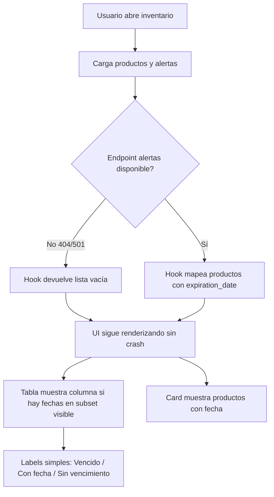

# Proposal: UI de vencimiento opcional para productos de inventario

## Intent

Agregar soporte frontend para productos con fecha de vencimiento opcional en el módulo de inventario, manteniendo una primera fase simple, mock-friendly y compatible con un backend todavía incompleto.

## Scope

### In Scope
- Extender tipos frontend con `expiration_date?: string`
- Permitir capturar fecha de vencimiento opcional en alta/edición de productos
- Mostrar columna `Vencimiento` en la tabla cuando el subset visible tenga al menos un producto con fecha
- Mostrar estado simple en UI: `Vencido`, `Con fecha`, `Sin vencimiento`
- Mostrar una tarjeta resumen de productos con fecha de vencimiento
- Hacer graceful degradation cuando `/api/inventory/alerts/expiring` responda 404/501
- Cubrir flujo con tests unitarios/integración focalizados

### Out of Scope
- Migraciones de base de datos
- Lógica backend de cálculo de alertas
- Umbrales avanzados tipo 7/15/30 días
- Reglas de proximidad o severidad por `days_remaining`

## Approach

Tratar `expiration_date` como un campo opcional y aditivo. La UI no expondrá umbrales de severidad en esta fase: solo indicará si el producto está vencido, si tiene una fecha futura/cargada, o si no tiene vencimiento. La capa de datos absorberá la ausencia del endpoint de alertas devolviendo `[]` para no romper la página.

## Affected Areas

| Area | Impact | Description |
|------|--------|-------------|
| `src/types/inventory.ts` | Modified | Tipos y helpers simples de vencimiento |
| `src/hooks/use-inventory.ts` | Modified | Mapper y hook `useExpiringProducts()` |
| `src/components/inventory/add-product-dialog.tsx` | Modified | Campo opcional de fecha |
| `src/components/inventory/edit-product-dialog.tsx` | Modified | Precarga y edición de fecha |
| `src/components/inventory/products-table.tsx` | Modified | Columna condicional + labels simples |
| `src/components/inventory/expiring-products-card.tsx` | New/Modified | Tarjeta resumen simple |
| `src/pages/inventory-page.tsx` | Modified | Wiring de la tarjeta de vencimientos |
| `src/**/*.expiration.test.*` | Modified | Cobertura para comportamiento simple |

## Risks

| Risk | Likelihood | Mitigation |
|------|------------|------------|
| Drift entre diseño y UI implementada | Medium | Fijar contrato explícito de labels simples en specs y design |
| Backend ausente para alertas | High | Swallow 404/501 en `useExpiringProducts()` |
| Confusión por productos sin fecha | Low | Mostrar explícitamente `Sin vencimiento` |

## Rollback Plan

1. Revertir los cambios de tipos, hooks y componentes del módulo de inventario
2. Quitar la columna `Vencimiento` y la tarjeta resumen
3. Mantener el inventario con su comportamiento previo sin fechas de vencimiento

## Dependencies

- Backend futuro para persistir `expiration_date`
- Endpoint opcional `/api/inventory/alerts/expiring`
- React Query + Axios existentes en el frontend

## Success Criteria

- [ ] Alta y edición permiten dejar la fecha vacía
- [ ] La tabla muestra `Vencido`, `Con fecha` o `Sin vencimiento`
- [ ] La tarjeta resumen no rompe si el backend de alertas no existe
- [ ] `tsc --noEmit` pasa
- [ ] Tests focalizados de expiración pasan

## Flow Diagram

