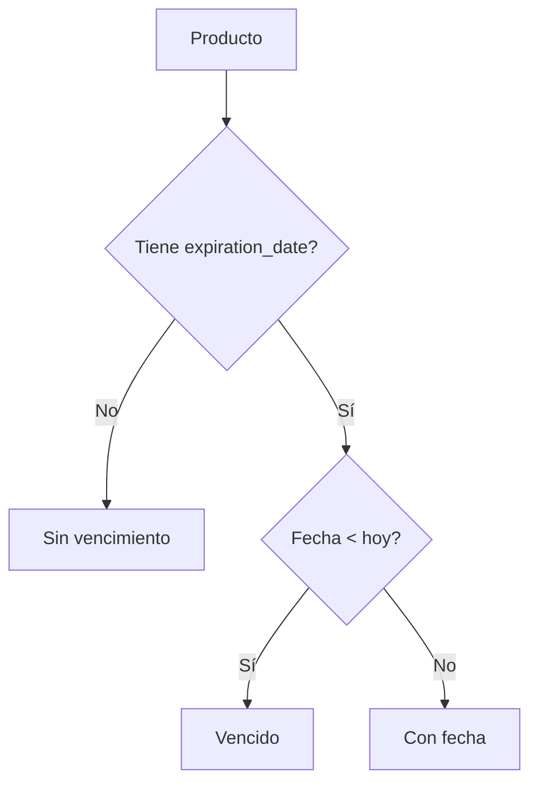

# Delta for Inventory Expiration UI

## ADDED Requirements

### Requirement: Optional Expiration Date Input

El sistema DEBE permitir registrar y editar una fecha de vencimiento opcional en los formularios de producto.

#### Scenario: Usuario deja la fecha vacía

- GIVEN un usuario en alta o edición de producto
- WHEN deja el campo de fecha vacío
- THEN el sistema DEBE enviar el producto sin `expiration_date`
- AND el guardado NO DEBE fallar por este motivo

#### Scenario: Usuario carga una fecha válida

- GIVEN un usuario en alta o edición de producto
- WHEN ingresa una fecha válida
- THEN el sistema DEBE incluir `expiration_date` en el payload enviado

### Requirement: Simple Expiration Status Display

La UI DEBE representar el estado de vencimiento con el modelo simple aprobado: `Vencido`, `Con fecha`, `Sin vencimiento`.

#### Scenario: Producto sin fecha de vencimiento

- GIVEN un producto sin `expiration_date`
- WHEN se renderiza en la tabla
- THEN el sistema DEBE mostrar `Sin vencimiento`

#### Scenario: Producto con fecha futura

- GIVEN un producto con `expiration_date` futura o vigente
- WHEN se renderiza en la tabla o tarjeta resumen
- THEN el sistema DEBE mostrar `Con fecha`
- AND DEBE mostrar la fecha formateada

#### Scenario: Producto vencido

- GIVEN un producto con `expiration_date` anterior a hoy
- WHEN se renderiza en la tabla o tarjeta resumen
- THEN el sistema DEBE mostrar `Vencido`

### Requirement: Conditional Expiration Column

La tabla de productos DEBE mostrar la columna `Vencimiento` solo cuando el subset visible contenga al menos un producto con fecha.

#### Scenario: Página visible sin fechas

- GIVEN una página visible de la tabla donde ningún producto tiene `expiration_date`
- WHEN la tabla se renderiza
- THEN la columna `Vencimiento` NO DEBE mostrarse

#### Scenario: Página visible con al menos una fecha

- GIVEN una página visible de la tabla donde al menos un producto tiene `expiration_date`
- WHEN la tabla se renderiza
- THEN la columna `Vencimiento` DEBE mostrarse

### Requirement: Resilient Alerts Data

El hook de alertas DEBE tolerar la ausencia del endpoint backend de vencimientos.

#### Scenario: Backend todavía no implementado

- GIVEN que `/api/inventory/alerts/expiring` responde 404 o 501
- WHEN la página de inventario carga
- THEN el hook DEBE devolver `[]`
- AND la UI NO DEBE crashear

### Requirement: Simple Expiration Summary Card

La página de inventario DEBE poder mostrar una tarjeta resumen de productos con fecha de vencimiento cuando existan datos.

#### Scenario: Hay productos con fecha desde el endpoint

- GIVEN que el endpoint devuelve productos con `expiration_date`
- WHEN la página de inventario carga
- THEN la tarjeta DEBE listar esos productos
- AND cada fila DEBE mostrar nombre, fecha formateada, cantidad y badge simple

#### Scenario: No hay productos o el endpoint no existe

- GIVEN que el hook devuelve `[]`
- WHEN la página de inventario carga
- THEN la tarjeta PUEDE ocultarse completamente

## MODIFIED Requirements

### Requirement: Expiration UI scope

La primera fase de UI de vencimientos DEBE mantenerse simple y mock-friendly, sin umbrales de proximidad ni severidad por `days_remaining`.

#### Scenario: Diseño de primera fase

- GIVEN la implementación actual del frontend
- WHEN se evalúa el comportamiento de vencimiento
- THEN la UI NO DEBE exponer `critical`, `warning` ni `ok`
- AND solo DEBE exponer `Vencido`, `Con fecha` y `Sin vencimiento`

## Additional Diagram

