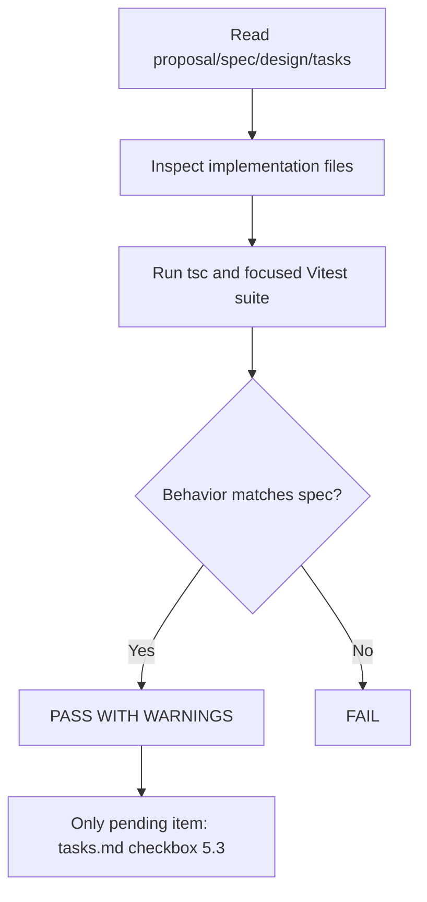

# Verification Report: UI de vencimiento opcional para productos de inventario

## Change

`inventory-product-expiration-ui`

## Completeness

| Metric | Value |
|--------|-------|
| Tasks total | 21 |
| Tasks complete | 20 |
| Tasks incomplete | 1 |

### Incomplete Tasks

- [ ] 5.3 Re-ejecutar `/sdd:verify inventory-product-expiration-ui` y confirmar PASS

> Nota: la única tarea pendiente es autorreferencial. Esta verificación confirma el PASS funcional, pero el checkbox en `tasks.md` todavía no fue actualizado.

## Correctness (Specs)

| Requirement | Status | Notes |
|------------|--------|-------|
| Optional Expiration Date Input | ✅ Implemented | Alta y edición normalizan vacío a `undefined` e incluyen `expiration_date` cuando hay fecha. |
| Simple Expiration Status Display | ✅ Implemented | La UI expone `Vencido`, `Con fecha` y `Sin vencimiento` con fecha formateada cuando corresponde. |
| Conditional Expiration Column | ✅ Implemented | `ProductsTable` muestra `Vencimiento` solo si el subset paginado visible tiene al menos un producto con fecha. |
| Resilient Alerts Data | ✅ Implemented | `useExpiringProducts()` devuelve `[]` ante 404/501 y re-lanza errores inesperados. |
| Simple Expiration Summary Card | ✅ Implemented | La tarjeta lista nombre, fecha formateada, cantidad y badge simple; retorna `null` si no hay datos. |
| Expiration UI scope | ✅ Implemented | No se exponen estados `critical`, `warning` ni `ok` en la UI de vencimiento. |

### Scenarios Coverage

| Scenario | Status |
|----------|--------|
| Usuario deja la fecha vacía | ✅ Covered |
| Usuario carga una fecha válida | ✅ Covered |
| Producto sin fecha de vencimiento | ✅ Covered |
| Producto con fecha futura | ✅ Covered |
| Producto vencido | ✅ Covered |
| Página visible sin fechas | ✅ Covered |
| Página visible con al menos una fecha | ✅ Covered |
| Backend todavía no implementado | ✅ Covered |
| Hay productos con fecha desde el endpoint | ✅ Covered |
| No hay productos o el endpoint no existe | ✅ Covered |
| Diseño de primera fase simple | ✅ Covered |

## Coherence (Design)

| Decision | Followed? | Notes |
|----------|-----------|-------|
| Modelo simple de estados de vencimiento | ✅ Yes | `inventory.ts` usa `expired | has_date | none` y labels simples de presentación. |
| Columna condicional por subset visible | ✅ Yes | La condición usa `paginatedProducts.some(...)`, no el dataset total. |
| Graceful degradation en hook | ✅ Yes | `useExpiringProducts()` encapsula 404/501 dentro del queryFn. |
| Tarjeta resumen simple | ✅ Yes | `ExpiringProductsCard` mantiene alcance visual sin lógica de severidad por proximidad. |
| File changes planned in design | ✅ Yes | Los archivos planificados existen y reflejan el contrato acordado. |

## Testing

| Area | Tests Exist? | Coverage |
|------|-------------|----------|
| Type helpers (`inventory.ts`) | Yes | Good |
| Mapper `expiration_date` | Yes | Good |
| `useExpiringProducts()` fallback | Yes | Good |
| Add/Edit dialogs payloads | Yes | Good |
| `ProductsTable` conditional column and labels | Yes | Good |
| `ExpiringProductsCard` rendering | Yes | Good |
| TypeScript validation | Yes | Good |

### Commands Run

- `npx tsc --noEmit` ✅
- `npx vitest run src/types/inventory.expiration.test.ts src/hooks/use-inventory.mapper.expiration.test.tsx src/hooks/use-inventory.expiration.test.tsx src/components/inventory/add-product-dialog.expiration.test.tsx src/components/inventory/edit-product-dialog.expiration.test.tsx src/components/inventory/products-table.expiration.test.tsx src/components/inventory/expiring-products-card.test.tsx` ✅ (49 tests passed)

## Issues Found

### CRITICAL

None.

### WARNING

- `tasks.md` todavía deja sin marcar la tarea 5.3, aunque esta corrida de verify ya valida el cambio como PASS funcional. Si el flujo SDD exige 100% de checkboxes antes de archive, queda pendiente actualizar ese artefacto.

### SUGGESTION

- Agregar una prueba a nivel de página (`InventoryPage`) para cubrir explícitamente la integración entre `useExpiringProducts()` y `ExpiringProductsCard`, aunque la cobertura actual por unidades ya valida el comportamiento principal.

## Verdict

**PASS WITH WARNINGS**

La implementación cumple propuesta, specs, diseño y tests del cambio; el único desvío restante es de bookkeeping en `tasks.md`, no de comportamiento.

## Verification Flow

