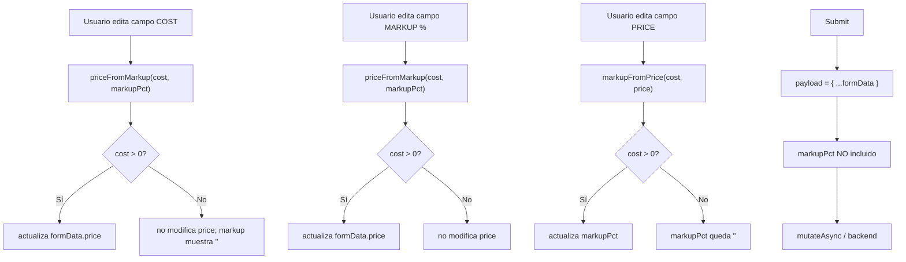

# Design: Helper de Markup % en dialogs de alta/edición de productos

## Technical Approach

Cambio frontend-only y aditivo. Se introduce un módulo utilitario puro `src/lib/markup.ts`
que encapsula la aritmética de markup/precio. Los dialogs `AddProductDialog` y
`EditProductDialog` gestionan `markupPct` como estado local de React **independiente de
`formData`**, de modo que nunca llega al payload enviado al backend. La relación entre
los tres valores (cost / markupPct / price) se mantiene vía handlers de cambio dedicados:
editar cost o markupPct recalcula price; editar price recalcula markupPct. El caso
`cost = 0` es manejado por el helper, que devuelve `null` para evitar NaN/Infinity pero
siempre permite edición manual del precio.

## Architecture Decisions

### Decision: helper puro en `src/lib/markup.ts`

**Choice**: módulo de funciones puras tipadas sin efecto secundario.
**Alternatives considered**: lógica inline en cada dialog; custom hook `useMarkup`.
**Rationale**: la aritmética es trivialmente testeable como función pura. Un hook añadiría
estado innecesario para algo que se puede calcular con un único `useState` en el dialog.
Colocar el helper en `src/lib/` sigue el patrón ya establecido por `currency.ts` y `theme.ts`.

### Decision: `markupPct` como estado local, nunca en `formData`

**Choice**: `const [markupPct, setMarkupPct] = useState<number | ''>(...)` separado de
`formData: CreateProductInput / UpdateProductInput`.
**Alternatives considered**: añadir `markupPct` a `formData`; pasar a un store Zustand.
**Rationale**: `markupPct` es un artefacto de UX de solo lectura/escritura local; no existe
en el modelo de dominio ni en el contrato de API. Mantenerlo fuera de `formData` garantiza
que el payload del submit no lo incluya, sin necesidad de hacer `delete payload.markupPct`.

### Decision: UI de markup en la misma fila "Precio / Costo"

**Choice**: añadir un tercer campo "Markup %" en la fila de precio/costo, convirtiendo esa
sección en un grid de 3 columnas.
**Alternatives considered**: fila separada debajo; tooltip/popover de cálculo.
**Rationale**: la relación visual cost ↔ markup ↔ price es obvia al mostrarlos juntos.
Un grid de 3 col es consistente con el layout `grid-cols-2` ya existente — solo se amplía.

### Decision: tolerancia a `cost = 0`

**Choice**: `priceFromMarkup(cost, markupPct)` devuelve `null` cuando `cost <= 0`.
En ese caso el campo Precio queda editable manualmente y el campo Markup % muestra `''`.
**Alternatives considered**: bloquear el campo Markup % cuando cost=0; lanzar excepción.
**Rationale**: no se puede dividir entre 0, pero el precio sigue siendo un dato requerido.
Devolver `null` (en lugar de NaN/Infinity) y dejar el precio sin tocar es la solución
más segura y discernible para el usuario.

## Data Flow



## File Changes

| File | Action | Description |
|------|--------|-------------|
| `src/lib/markup.ts` | Create | Helper puro con `priceFromMarkup`, `markupFromPrice` y `formatMarkup` |
| `src/lib/markup.test.ts` | Create | Tests unitarios del helper: cálculos nominales, cost=0, negativos |
| `src/components/inventory/add-product-dialog.tsx` | Modify | Añadir estado `markupPct`, campo Markup % en UI, handlers cruzados |
| `src/components/inventory/edit-product-dialog.tsx` | Modify | Ídem con precarga de markup derivado del producto existente |
| `src/components/inventory/add-product-dialog.markup.test.tsx` | Create | Tests de integración: payload sin markupPct, cálculo UI correcto |
| `src/components/inventory/edit-product-dialog.markup.test.tsx` | Create | Tests de integración: precarga de markup, payload sin markupPct |

## Interfaces / Contracts

```ts
// src/lib/markup.ts

/**
 * Calcula el precio a partir del costo y el porcentaje de markup.
 * Devuelve null si cost <= 0 para evitar NaN/Infinity.
 *
 * @param cost - Costo del producto (debe ser > 0 para calcular)
 * @param markupPct - Porcentaje de markup (ej: 30 = 30%)
 * @returns Precio calculado redondeado a 2 decimales, o null si cost <= 0
 */
export function priceFromMarkup(cost: number, markupPct: number): number | null;

/**
 * Calcula el porcentaje de markup a partir del costo y el precio.
 * Devuelve null si cost <= 0 para evitar NaN/Infinity.
 *
 * @param cost - Costo del producto (debe ser > 0 para calcular)
 * @param price - Precio de venta
 * @returns Markup en porcentaje redondeado a 2 decimales, o null si cost <= 0
 */
export function markupFromPrice(cost: number, price: number): number | null;

/**
 * Formatea el markup para mostrarlo en el input (string sin símbolo %).
 * Devuelve '' si markup es null.
 */
export function formatMarkup(markup: number | null): string;
```

```ts
// Estado local en AddProductDialog / EditProductDialog (NO en formData)
const [markupPct, setMarkupPct] = useState<number | ''>(() => {
  const derived = markupFromPrice(initialCost, initialPrice);
  return derived ?? '';
});
```

Los tipos `CreateProductInput` y `UpdateProductInput` en `src/types/inventory.ts` **no se
modifican**: `markupPct` no tiene cabida en ninguno de los dos.

## Testing Strategy

| Layer | What to Test | Approach |
|-------|-------------|----------|
| Unit | `priceFromMarkup`: nominal, markup 0%, markup 100%, cost=0, negativos | `vitest` + `describe/it` puro, sin DOM |
| Unit | `markupFromPrice`: nominal, price=cost (0%), cost=0 | ídem |
| Integration | `AddProductDialog`: payload submit no contiene `markupPct` | mock `useAddProduct`, `userEvent` |
| Integration | `AddProductDialog`: editar cost recalcula precio en UI | `userEvent` + `screen.getByLabelText` |
| Integration | `EditProductDialog`: markup precargado correctamente al abrir | render con `product` mock, assert input value |
| Integration | `EditProductDialog`: payload submit no contiene `markupPct` | mock `useUpdateProduct`, `userEvent` |

Convención de nombres de archivo de test ya existente en el proyecto:
`{component}.{feature}.test.tsx` → `add-product-dialog.markup.test.tsx`

## Migration / Rollout

No requiere migración. Cambio aditivo puro: el helper es nuevo y los dialogs solo extienden
su estado local. Ningún contrato de API cambia. Compatible con backend en cualquier estado.

## Open Questions

- [ ] ¿Se mostrará el markup calculado también en la tabla de productos (columna derivada)?
      Si sí, abrir un cambio separado para evitar ampliar el alcance de este.
- [ ] ¿El Markup % debe persistirse en `localStorage` como preferencia del usuario entre sesiones?
      Por ahora se asume que no: se recalcula cada vez que se abre el dialog.
