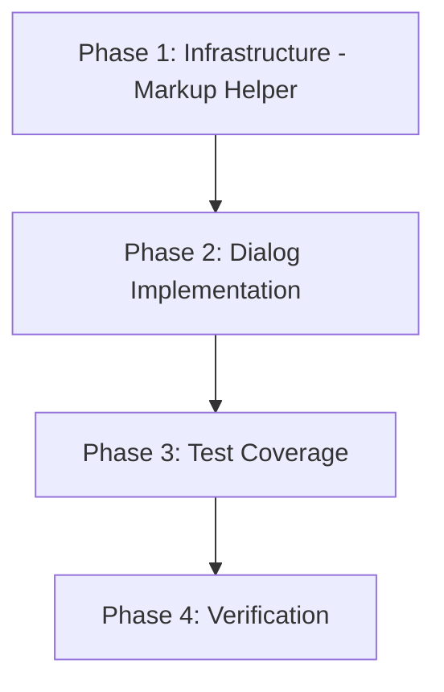

# Tasks: Product Price Markup UI

## Phase 1: Infrastructure - Markup Helper

- [x] 1.1 Crear `src/lib/markup.ts` con funciones puras tipadas `priceFromMarkup`, `markupFromPrice` y `formatMarkup`, incluyendo guardas para `cost <= 0` que devuelvan `null` y eviten `NaN/Infinity`.
- [x] 1.2 Definir en `src/lib/markup.ts` la regla de redondeo a 2 decimales para precio/markup derivados y el formateo de `null` a `''` para rendering seguro del input de Markup %.

## Phase 2: Dialog Implementation

- [x] 2.1 Modificar `src/components/inventory/add-product-dialog.tsx` para agregar campo `Markup %` y estado local `markupPct` separado de `formData`.
- [x] 2.2 Implementar en `src/components/inventory/add-product-dialog.tsx` el flujo bidireccional: `cost + markupPct => price` y edición manual de `price => markupPct` usando `src/lib/markup.ts`.
- [x] 2.3 Asegurar en `src/components/inventory/add-product-dialog.tsx` que `markupPct` permanezca solo en estado local UI y NO forme parte del payload enviado al backend.
- [x] 2.4 Modificar `src/components/inventory/edit-product-dialog.tsx` para agregar campo `Markup %`, inicializar `markupPct` derivado desde `cost/price` existentes y mantenerlo fuera de `formData`.
- [x] 2.5 Implementar en `src/components/inventory/edit-product-dialog.tsx` el flujo bidireccional `cost/markup/price`, incluyendo el caso `cost = 0` (precio manual permitido, markup vacío/derivado nulo, sin crash).
- [x] 2.6 Verificar en ambos dialogs (`src/components/inventory/add-product-dialog.tsx`, `src/components/inventory/edit-product-dialog.tsx`) que el cambio sea UI-only y no requiera cambios en API, backend ni base de datos.

## Phase 3: Test Coverage

- [x] 3.1 Crear `src/lib/markup.test.ts` con casos unitarios para `priceFromMarkup` (nominal, 0%, 100%, `cost=0`, costos negativos) y validación explícita de ausencia de `NaN/Infinity`.
- [x] 3.2 Crear `src/lib/markup.test.ts` con casos unitarios para `markupFromPrice` (nominal, `price=cost`, `cost=0`) y `formatMarkup` (`null -> ''`, número -> string).
- [x] 3.3 Crear `src/components/inventory/add-product-dialog.markup.test.tsx` para cubrir cálculo dinámico UI (cost/markup -> price, price manual -> markup) y submit sin `markupPct` en payload.
- [x] 3.4 Crear `src/components/inventory/edit-product-dialog.markup.test.tsx` para cubrir precarga de markup derivado al abrir, recálculo bidireccional y submit sin `markupPct` en payload.
- [x] 3.5 Cubrir en ambos tests de dialogs (`add-product-dialog.markup.test.tsx` y `edit-product-dialog.markup.test.tsx`) el escenario `cost=0`: precio manual permitido y markup no calculado inválidamente.

## Phase 4: Verification

- [x] 4.1 Validar que los cambios se limiten a `src/lib/markup.ts` y dialogs/tests de inventario, sin modificaciones en contratos de `src/types/inventory.ts` ni en capas API/backend.
- [x] 4.2 Ejecutar y dejar en verde la suite focalizada de tests de helper y dialogs de markup.
- [x] 4.3 Confirmar contra spec/proposal/design que se cumplan: helper local en `src/lib/markup.ts`, cálculo bidireccional, exclusión de `markupPct` del payload y manejo seguro de `cost=0`.
